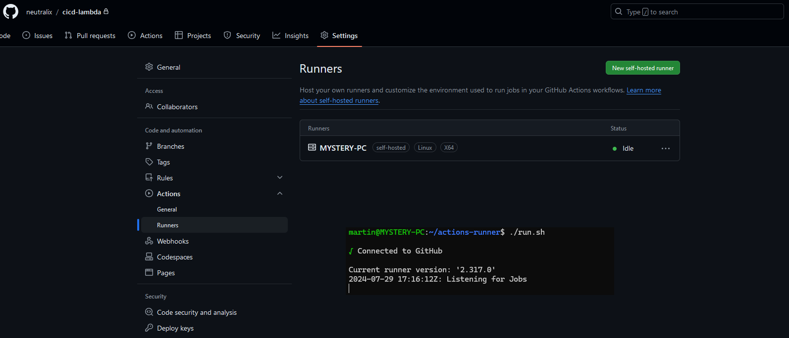
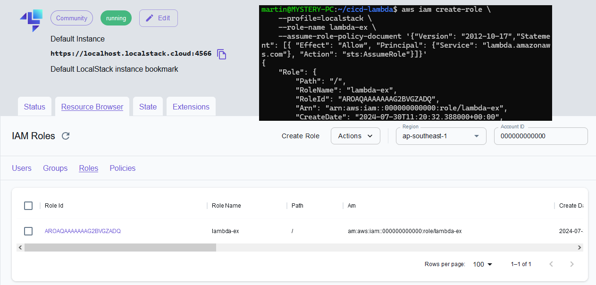
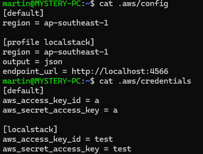
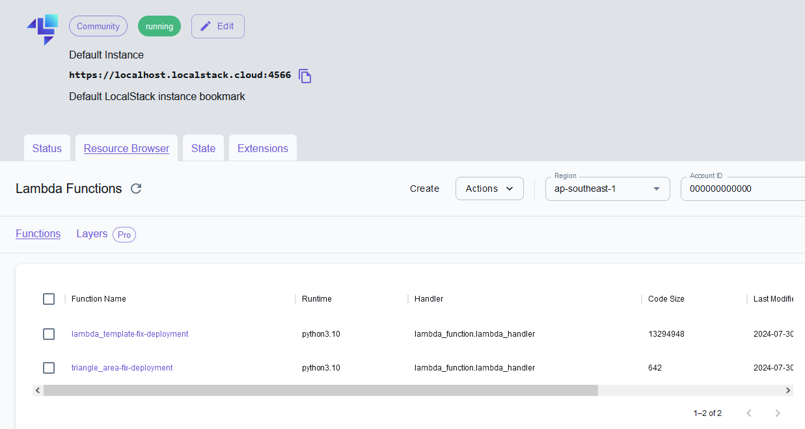
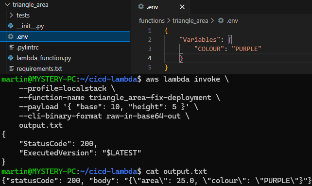

# GitHub Actions CI/CD for AWS Lambda

## Overview
This document provides information about the CI/CD for deploying AWS Lambda functions on a monorepo. The CI/CD is managed using GitHub Actions workflow and involves several stages from lint test, unit test, and lambda deployment.

Monorepo structure:
```
.
└── functions/
    ├── lambda_template/                    <--- root directory for a lambda function
    │   ├── tests/                          <--- put all unit test code here
    │   │   └── test_lambda_function.py
    │   ├── __init__.py
    │   ├── .env                            <--- modify environment for lambda function
    │   ├── .pylintrc                       <--- modify lint test configuration
    │   ├── lambda_function.py
    │   └── requirements.txt                <--- put all dependency here
    ├── (add new function here)
    ├── (add new function here)
    └── (add new function here)
```

Lambda function is run using `Python 3.10` and `x64` architecture. To initiate a new function, please copy `lambda_template` directory.  
From there you can modify your lambda function code, along with unit test function under `tests/` directory.  
This CI/CD handle Python library depedency installation. List out library name on `requirements.txt` file.  
To modify lambda function environment, modify your environment on `.env` file.  
Lint test can be configured as needed on `.pylintrc` file.  

## CI/CD Flow Diagram
[Insert Flow Diagram Here]

## Assumptions
- GitHub repository has a self-hosted runner set up.
- Docker and LocalStack are used to simulate local AWS.
- AWS CLI on CI/CD has been statically configured for LocalStack.
- CI/CD will push lambda code with fixed pre-created AWS IAM Role and handler.

## Branching Strategy
- Master branch  
Branch name pattern: **`main`**  
Main branch of the repository. This branch holds the stable and production-ready code.  
CI/CD will run on commit to this branch to push all lambda function under functions directory.  
Pushed function will have function name according to their directory name.  
Function on directory **`example`** will have function name **`example`**.  
- Development Branch  
Branch name pattern : **`feature/*`**  
Feature branch for development purpose. This branch could be used for developing new features, bug fixes, or other changes.  
CI/CD will also run on commit to this branch to push all lambda function under functions directory.  
Pushed function will have function name according to their directory name, with added suffix of the branch name.  
Function on directory **`example`** on branch **`feature/test`** will have function name **`example-test`**.  
- Flexible Branch  
Branch name pattern : **`*`**  
Free branch for any purpose. CI/CD will not run on this branch. This branch could be used to work that doesn't require immediate lambda function push.  

## Documentation
I set up a self-hosted runner for this repository to help myself get quicker feedback on developing this CI/CD.  



Then I setup LocalStack to simulate local AWS, along with fixed AWS IAM Role to be used by lambda function.

> aws iam create-role \
    --profile=localstack \
    --role-name lambda-ex \
    --assume-role-policy-document '{"Version": "2012-10-17","Statement": [{ "Effect": "Allow", "Principal": {"Service": "lambda.amazonaws.com"}, "Action": "sts:AssumeRole"}]}' 



AWS CLI on runner host is configured to have `localstack` profile.  



Following that I create lambda directory design to test out `lint-test` and `unit-test` scripts.  
Here are some CI/CD run where `lint-test` or `unit-test` is failed:  
https://github.com/neutralix/cicd-lambda/actions/runs/10130830693/job/28012731917  
https://github.com/neutralix/cicd-lambda/actions/runs/10162175928/job/28102315125  

To better understand about AWS lambda deployment, I read AWS docs:  
- Lambda environment variables (https://docs.aws.amazon.com/lambda/latest/dg/configuration-envvars.html)  
- Building Lambda together with its depedencies (https://docs.aws.amazon.com/lambda/latest/dg/python-package.html)  

All depedencies will be installed under package directory and zipped together with handler code at root to have a flat directory structure.  

Deployment script will list all currently available function with `list-functions`.  
> aws lambda list-functions --profile localstack

If it needs to create new lambda, it will call `create-function`.  
> aws lambda create-function \
    --profile localstack \
    --function-name $FUNCTION_NAME \
    --runtime python3.10 \
    --role arn:aws:iam::000000000000:role/lambda-ex \
    --handler lambda_function.lambda_handler \
    --zip-file fileb://lambda.zip

If it needs to update existing lambda, it will call `update-function-code`  
> aws lambda update-function-code \
    --profile localstack \
    --function-name $FUNCTION_NAME \
    --zip-file fileb://lambda.zip

Finally, it will update lambda environment with `update-function-configuration`
> aws lambda update-function-configuration \
    --profile=localstack \
    --function-name $FUNCTION_NAME \
    --environment file://.env

Example of a successful complete CI/CD run:
https://github.com/neutralix/cicd-lambda/actions/runs/10163165668

As we can see, lambda function are deployed to LocalStack.



Example result of existing lambda function invoke. The example environment returned by the lambda match our environment file.




## Limitation & Improvement
a
credential aws bisa ditaro di github secrets
